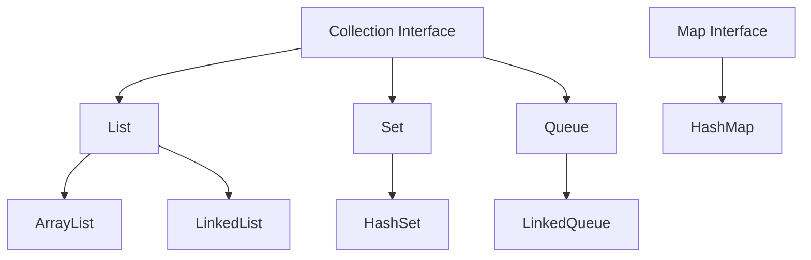

<div align="center">
  <h1>ts-collections</h1>
  <p><strong>A robust, type-safe collections framework for TypeScript</strong></p>
  
  [](https://opensource.org/licenses/MIT)
  [](https://www.typescriptlang.org/)
  [](https://www.npmjs.com/package/ts-collections)
  [](https://vitest.dev/)
  
  
  <p>
    <a href="#-features">Features</a> •
    <a href="#-quick-start">Quick Start</a> •
    <a href="#-api-overview">API Overview</a> •
    <a href="#-documentation">Documentation</a> •
    <a href="#-contributing">Contributing</a>
  </p>
</div>

---

## 🌟 Why ts-collections?

**ts-collections** is a Java-inspired collections framework that brings enterprise-grade data structures to TypeScript. Built with modern TypeScript features, it provides automatic type safety, familiar APIs for Java developers, and zero-configuration setup.

```typescript
import { ArrayList, HashMap, HashSet } from 'ts-collections';

// Automatic type safety - no configuration needed!
const list = new ArrayList<number>();
list.add(42);           // ✅ Works
list.add("text" as any); // ❌ Runtime error (caught automatically)

// Familiar Java-style APIs
const map = new HashMap<string, User>();
map.put("john", user);
const value = map.get("john");

// Complete type inference
const set = new HashSet<string>();
set.add("unique");
```

## ✨ Features

<table>
<tr>
<td width="50%">

### 🔒 Automatic Type Safety
Runtime type checking enabled by default - no configuration needed. Works just like Java's type-safe collections.

### 🎯 Zero Configuration  
Type safety works out of the box. No need to learn validation libraries or configure schemas.

### ☕ Java-Friendly
Familiar Collections interface for Java developers. If you know Java Collections, you already know ts-collections.

</td>
<td width="50%">

### 🏗️ Extensible Architecture
Easy to create custom implementations through abstract base classes and clear interfaces.

### 📊 Performance Transparency
All operations documented with time/space complexity (O-notation).

### ✅ Battle-Tested
332/332 tests passing. Comprehensive test coverage for all implementations.

</td>
</tr>
</table>

### Coming from Java?

You'll feel right at home! Type safety works exactly like Java:

```typescript
// Java
List<Integer> list = new ArrayList<>();
list.add(1);
list.add("text"); // ❌ Compile error

// TypeScript with ts-collections
const list = new ArrayList<number>();
list.add(1);
list.add("text" as any); // ❌ Runtime error (automatic!)
```

📖 **[Java Migration Guide →](JAVA_MIGRATION_GUIDE.md)**

## 📚 API Overview

### Core Interfaces

| Interface | Description | Key Methods |
|-----------|-------------|-------------|
| **Collection\<E>** | Base interface for all collections | `add()`, `remove()`, `size()`, `contains()` |
| **List\<E>** | Ordered, indexed collection | `get()`, `set()`, `indexOf()`, `subList()` |
| **Set\<E>** | Unique elements, no duplicates | Inherits Collection with uniqueness |
| **Map\<K,V>** | Key-value associations | `put()`, `get()`, `containsKey()`, `entries()` |
| **Queue\<E>** | FIFO processing | `offer()`, `poll()`, `peek()` |

### Available Implementations

| Type | Implementation | Characteristics |
|------|----------------|-----------------|
| **List** | `ArrayList<E>` | Dynamic array, fast random access O(1) |
| **List** | `LinkedList<E>` | Doubly-linked, fast insertion/deletion |
| **Set** | `HashSet<E>` | Hash table, fast lookup O(1) average |
| **Map** | `HashMap<K,V>` | Hash table, fast key lookup O(1) average |
| **Queue** | `LinkedQueue<E>` | Linked list, FIFO operations O(1) |

### Architecture



## 📦 Installation

```bash
npm install ts-collections
```

<details>
<summary>Other package managers</summary>

```bash
# Using pnpm
pnpm add ts-collections

# Using yarn
yarn add ts-collections
```
</details>

## 🚀 Quick Start

### Lists - Ordered Collections

```typescript
import { ArrayList } from 'ts-collections';

const list = new ArrayList<number>();
list.add(10);
list.add(20);
list.add(30);

console.log(list.get(0));     // 10
console.log(list.size());     // 3
list.removeAt(1);             // [10, 30]
```

### Sets - Unique Elements

```typescript
import { HashSet } from 'ts-collections';

const set = new HashSet<string>();
set.add("apple");
set.add("banana");
set.add("apple");  // Duplicate ignored

console.log(set.size());           // 2
console.log(set.contains("apple")); // true
```

### Maps - Key-Value Pairs

```typescript
import { HashMap } from 'ts-collections';

const map = new HashMap<string, number>();
map.put("Alice", 25);
map.put("Bob", 30);

console.log(map.get("Alice"));        // 25
console.log(map.containsKey("Bob"));  // true
```

### Queues - FIFO Processing

```typescript
import { LinkedQueue } from 'ts-collections';

const queue = new LinkedQueue<string>();
queue.offer("Task 1");
queue.offer("Task 2");

console.log(queue.poll());  // "Task 1"
console.log(queue.peek());  // "Task 2"
```

## 💡 Common Use Cases

<details>
<summary><strong>Shopping Cart Example</strong></summary>

```typescript
import { ArrayList } from 'ts-collections';

interface Product {
  id: string;
  name: string;
  price: number;
}

class ShoppingCart {
  private items = new ArrayList<Product>();

  addItem(product: Product): void {
    this.items.add(product);
  }

  getTotalPrice(): number {
    return this.items.toArray().reduce((sum, item) => sum + item.price, 0);
  }
}

const cart = new ShoppingCart();
cart.addItem({ id: "1", name: "Laptop", price: 999 });
console.log(cart.getTotalPrice()); // 999
```
</details>

<details>
<summary><strong>Session Management with Maps</strong></summary>

```typescript
import { HashMap } from 'ts-collections';

interface Session {
  userId: string;
  loginTime: Date;
}

class SessionManager {
  private sessions = new HashMap<string, Session>();

  createSession(userId: string): string {
    const sessionId = this.generateId();
    this.sessions.put(sessionId, { userId, loginTime: new Date() });
    return sessionId;
  }

  getSession(sessionId: string): Session | undefined {
    return this.sessions.get(sessionId);
  }
}
```
</details>

<details>
<summary><strong>Task Queue Processing</strong></summary>

```typescript
import { LinkedQueue } from 'ts-collections';

const taskQueue = new LinkedQueue<string>();

// Add tasks
taskQueue.offer("Process payment");
taskQueue.offer("Send email");
taskQueue.offer("Update inventory");

// Process tasks
while (taskQueue.size() > 0) {
  const task = taskQueue.poll();
  console.log(`Processing: ${task}`);
}
```
</details>

<details>
<summary><strong>Unique Tags with Sets</strong></summary>

```typescript
import { HashSet } from 'ts-collections';

class TagManager {
  private tags = new HashSet<string>();

  addTag(tag: string): boolean {
    return this.tags.add(tag.toLowerCase());
  }

  getTags(): string[] {
    return this.tags.toArray().sort();
  }
}

const tags = new TagManager();
tags.addTag("JavaScript");
tags.addTag("TypeScript");
tags.addTag("javascript"); // Duplicate ignored
console.log(tags.getTags()); // ["javascript", "typescript"]
```
</details>

### Advanced: Custom Validation with Zod (Optional)

```typescript
import { ArrayList } from 'ts-collections';
import { z } from 'zod';

// Advanced validation for power users
const strictNumbers = new ArrayList<number>({
    schema: z.number().positive().int()
});

strictNumbers.add(5);      // ✅ OK
strictNumbers.add(-1 as any);    // ❌ ERROR: must be positive
strictNumbers.add(3.14 as any);  // ❌ ERROR: must be integer
```

> **Note:** Zod is optional - basic type safety works automatically without it!

## 🏗️ Design Principles

**ts-collections** follows SOLID principles for maintainable, extensible code:

- **Single Responsibility**: Each class has one clear purpose
- **Open/Closed**: Extend through abstract classes without modifying existing code
- **Liskov Substitution**: Subclasses work anywhere their parent class works
- **Interface Segregation**: Clean, focused interfaces
- **Dependency Inversion**: Depend on abstractions, not concrete implementations

### Building Custom Collections

Extend abstract base classes to create your own data structures:

```typescript
import { AbstractList } from 'ts-collections';

class CustomList<E> extends AbstractList<E> {
  private elements: E[] = [];

  size(): number {
    return this.elements.length;
  }

  get(index: number): E {
    if (index < 0 || index >= this.size()) {
      throw new Error('Index out of bounds');
    }
    return this.elements[index];
  }

  // Implement remaining abstract methods...
}
```

## 📖 Documentation

### Quick References

- 📘 [QUICKSTART.md](QUICKSTART.md) - Get started in 5 minutes
- ☕ [JAVA_MIGRATION_GUIDE.md](JAVA_MIGRATION_GUIDE.md) - For Java developers
- ✅ [RUNTIME_VALIDATION.md](RUNTIME_VALIDATION.md) - Validation features deep dive
- 🏛️ [ARCHITECTURE.md](ARCHITECTURE.md) - Architecture and design decisions
- 🔧 [QUICK_REFERENCE.md](QUICK_REFERENCE.md) - API quick reference
- 🤝 [CONTRIBUTING.md](CONTRIBUTING.md) - How to contribute

### API Documentation

Generate full API docs with TypeDoc:

```bash
pnpm docs
```

## 🧪 Testing

All implementations have comprehensive test coverage (332/332 tests passing).

```bash
# Run all tests
pnpm test

# Watch mode
pnpm test --watch

# With coverage
pnpm test --coverage
```

## 🤝 Contributing

We welcome contributions! Here's how to get started:

1. **Fork** the repository
2. **Create** a feature branch: `git checkout -b feature/amazing-feature`
3. **Make** your changes
4. **Test** your changes: `pnpm test`
5. **Lint** your code: `pnpm lint`
6. **Commit** with clear messages
7. **Push** to your branch
8. **Open** a Pull Request

### Development Setup

```bash
# Clone and install
git clone https://github.com/Karelaking/ts-collections.git
cd ts-collections
pnpm install

# Development workflow
pnpm test          # Run tests
pnpm lint          # Check code style
pnpm build         # Build the project
pnpm docs          # Generate documentation
```

For detailed guidelines, see [CONTRIBUTING.md](CONTRIBUTING.md).

## 📊 Performance

All data structures document their performance characteristics:

| Operation | ArrayList | HashSet | HashMap | LinkedQueue |
|-----------|-----------|---------|---------|-------------|
| Add/Put | O(1)* | O(1)* | O(1)* | O(1) |
| Get | O(1) | - | O(1)* | - |
| Remove | O(n) | O(1)* | O(1)* | O(1) |
| Contains | O(n) | O(1)* | O(1)* | O(n) |
| Size | O(1) | O(1) | O(1) | O(1) |

\* amortized time complexity

Run benchmarks: `pnpm bench`

## 📄 License

This project is licensed under the MIT License - see [LICENSE](LICENSE) for details.

## 🙏 Acknowledgments

- Inspired by [Java Collections Framework](https://docs.oracle.com/javase/tutorial/collections/)
- Built with [TypeScript](https://www.typescriptlang.org/)
- Tested with [Vitest](https://vitest.dev/)

## 🔗 Links

- **GitHub**: [Karelaking/ts-collections](https://github.com/Karelaking/ts-collections)
- **npm**: [ts-collections](https://www.npmjs.com/package/ts-collections)
- **Issues**: [Report a bug](https://github.com/Karelaking/ts-collections/issues)
- **Discussions**: [Ask questions](https://github.com/Karelaking/ts-collections/discussions)

---

<div align="center">
  <strong>Made with ❤️ by the ts-collections team</strong>
  <br>
  <sub>⭐ Star us on GitHub if you find this useful!</sub>
</div>
