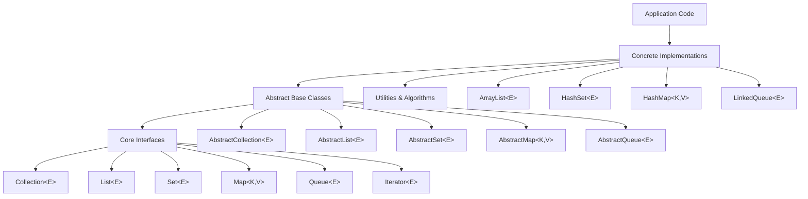

# TypeScript Collections Framework

[](https://opensource.org/licenses/MIT)
[](https://www.typescriptlang.org/)
[](https://vitest.dev/)


A fully-typed, Java-inspired Collections Framework for TypeScript, providing industry-grade implementations of Lists, Sets, Maps, Queues, and Iterators with strict type safety, predictable behavior, and comprehensive test coverage.

## 🎯 Goals

This project aims to provide:

- **Automatic Type Safety**: Runtime type checking enabled by default (no configuration needed)
- **Java-Friendly Design**: Familiar Collections interface for Java developers - works just like Java's type-safe collections
- **Zero-Configuration**: Type safety works out of the box, no need to learn validation libraries
- **Type Safety**: Full TypeScript support with generics and strict typing
- **Predictable Behavior**: Clear contracts through interfaces and abstract base classes
- **Extensibility**: Easy to create custom implementations through abstract base classes
- **Performance Transparency**: Clear documentation of algorithm complexity
- **Test Coverage**: Comprehensive test suites for all implementations (332/332 tests passing)
- **Open Source Quality**: Clean code, best practices, and community-driven development

### For Java Developers

Coming from Java? **You'll feel right at home!** Type safety is automatic by default:

```typescript
// Java
List<Integer> list = new ArrayList<>();
list.add(1);
list.add("text"); // ❌ Compile error

// TypeScript with ts-collections
const list = new ArrayList<number>();
list.add(1);
list.add("text" as any); // ❌ Runtime error (automatic!)
```

See [JAVA_MIGRATION_GUIDE.md](JAVA_MIGRATION_GUIDE.md) for detailed Java → TypeScript migration guidance.

## 🏗️ Architecture



### Core Interfaces

| Interface | Purpose | Methods |
|-----------|---------|---------|
| **Iterator** | Element traversal | `hasNext()`, `next()`, `remove?()` |
| **Collection** | Base collection | `size()`, `add()`, `remove()`, `contains()`, etc. |
| **List** | Ordered, index-accessible | Extends Collection + `get()`, `set()`, `addAt()`, `indexOf()` |
| **Set** | No duplicates | Extends Collection with uniqueness guarantee |
| **Map** | Key-value mappings | `put()`, `get()`, `remove()`, `keys()`, `values()` |
| **Queue** | FIFO processing | Extends Collection + `offer()`, `poll()`, `peek()` |

### Abstract Base Classes

| Class | Extends | Purpose |
|-------|---------|---------|
| **AbstractCollection** | — | Common Collection operations |
| **AbstractList** | AbstractCollection | Common List operations |
| **AbstractSet** | AbstractCollection | Set-specific behavior |
| **AbstractMap** | — | Common Map operations |
| **AbstractQueue** | AbstractCollection | Queue-specific behavior |

## 📦 Installation

```bash
npm install ts-collections
# or
pnpm add ts-collections
# or
yarn add ts-collections
```

## 🚀 Quick Start

### Automatic Type Safety (Zero Configuration)

**ts-collections** provides automatic runtime type safety out of the box - just like Java's type-safe collections. No configuration needed!

```typescript
import { ArrayList } from 'ts-collections';

const list = new ArrayList<number>();
list.add(1);        // ✓ OK
list.add(2);        // ✓ OK
list.add("text" as any);  // ❌ TypeError: type mismatch (automatic!)
```

**For Java Developers:** This works exactly like Java's `ArrayList<Integer>` - type safety is automatic and enforced at runtime with zero configuration.

### Using Lists

```typescript
import { ArrayList } from 'ts-collections';

// Create a new list with automatic type safety
const numbers = new ArrayList<number>();

// Add elements
numbers.add(10);
numbers.add(20);
numbers.add(30);
console.log(numbers.size()); // 3

// Index-based access
console.log(numbers.get(0)); // 10
console.log(numbers.get(2)); // 30

// Insert at specific position
numbers.addAt(1, 15); // [10, 15, 20, 30]

// Replace element
const oldValue = numbers.set(2, 25); // [10, 15, 25, 30]
console.log(oldValue); // 20

// Search operations
console.log(numbers.indexOf(25)); // 2
console.log(numbers.lastIndexOf(10)); // 0
console.log(numbers.contains(15)); // true

// Remove elements
const removed = numbers.removeAt(1); // [10, 25, 30]
console.log(removed); // 15

// Get sublist
const subList = numbers.subList(0, 2); // [10, 25]
console.log(subList.size()); // 2

// Iteration using iterator
const iterator = numbers.iterator();
while (iterator.hasNext()) {
  console.log(iterator.next());
}

// Convert to array
const array = numbers.toArray();
console.log(array); // [10, 25, 30]

// Clear the list
numbers.clear();
console.log(numbers.size()); // 0
```

### Using Sets

```typescript
import { HashSet } from 'ts-collections';

// Create a new set
const fruits = new HashSet<string>();

// Add elements (duplicates are ignored)
fruits.add("apple");
fruits.add("banana");
fruits.add("apple"); // Duplicate, won't be added
console.log(fruits.size()); // 2

// Check membership
console.log(fruits.contains("apple")); // true
console.log(fruits.contains("orange")); // false

// Add more elements
fruits.add("orange");
fruits.add("grape");

// Convert to array for iteration
const fruitArray = fruits.toArray();
console.log(fruitArray); // ["apple", "banana", "orange", "grape"]

// Iteration using iterator
const iterator = fruits.iterator();
while (iterator.hasNext()) {
  console.log(iterator.next());
}

// Set operations with collections
const tropicalFruits = new HashSet<string>();
tropicalFruits.add("banana");
tropicalFruits.add("pineapple");
tropicalFruits.add("mango");

// Remove all elements from another collection
fruits.removeAll(tropicalFruits); // Removes "banana"

// Retain only elements in another collection
const commonFruits = new HashSet<string>();
commonFruits.add("apple");
commonFruits.add("orange");
fruits.retainAll(commonFruits); // Keeps only "apple" and "orange"

// Clear the set
fruits.clear();
console.log(fruits.size()); // 0
```

### Using Maps

```typescript
import { HashMap } from 'ts-collections';

// Create a new map
const userAges = new HashMap<string, number>();

// Put key-value pairs
userAges.put("Alice", 25);
userAges.put("Bob", 30);
userAges.put("Charlie", 35);
console.log(userAges.size()); // 3

// Get values by key
console.log(userAges.get("Alice")); // 25
console.log(userAges.get("David")); // undefined

// Check key existence
console.log(userAges.containsKey("Bob")); // true
console.log(userAges.containsKey("David")); // false

// Check value existence
console.log(userAges.containsValue(30)); // true
console.log(userAges.containsValue(40)); // false

// Update existing key
const oldAge = userAges.put("Alice", 26); // Returns old value: 25
console.log(userAges.get("Alice")); // 26

// Remove entries
const removedAge = userAges.remove("Charlie"); // Returns 35
console.log(userAges.size()); // 2

// Get all keys and values
const keys = userAges.keys(); // ["Alice", "Bob"]
const values = userAges.values(); // Collection of [26, 30]
const entries = userAges.entries(); // [["Alice", 26], ["Bob", 30]]

// Iterate over keys
const keyIterator = userAges.keyIterator();
while (keyIterator.hasNext()) {
  const key = keyIterator.next();
  console.log(`${key}: ${userAges.get(key)}`);
}

// Iterate over values
const valueIterator = userAges.valueIterator();
while (valueIterator.hasNext()) {
  console.log(valueIterator.next());
}

// Check if empty and clear
console.log(userAges.isEmpty()); // false
userAges.clear();
console.log(userAges.isEmpty()); // true
```

### Using Queues

```typescript
import { LinkedQueue } from 'ts-collections';

// Create a new queue (FIFO - First In, First Out)
const taskQueue = new LinkedQueue<string>();

// Add elements to the queue
taskQueue.offer("Task 1");
taskQueue.offer("Task 2");
taskQueue.offer("Task 3");
console.log(taskQueue.size()); // 3

// Peek at the front without removing
console.log(taskQueue.peek()); // "Task 1"
console.log(taskQueue.size()); // 3 (unchanged)

// Remove and return the front element
const firstTask = taskQueue.poll(); // "Task 1"
console.log(firstTask);
console.log(taskQueue.size()); // 2

// Get the front element (throws if empty)
try {
  const nextTask = taskQueue.element(); // "Task 2"
  console.log(nextTask);
} catch (error) {
  console.log("Queue is empty");
}

// Process all remaining tasks
while (taskQueue.size() > 0) {
  const task = taskQueue.poll();
  console.log(`Processing: ${task}`);
}

// Check if queue contains elements
console.log(taskQueue.size()); // 0

// Add more tasks
taskQueue.offer("New Task A");
taskQueue.offer("New Task B");

// Check containment
console.log(taskQueue.contains("New Task A")); // true
console.log(taskQueue.contains("Old Task")); // false

// Remove specific element
const removed = taskQueue.remove("New Task A"); // true
console.log(taskQueue.size()); // 1

// Convert to array
const remainingTasks = taskQueue.toArray();
console.log(remainingTasks); // ["New Task B"]

// Clear the queue
taskQueue.clear();
console.log(taskQueue.size()); // 0
```

### Advanced Type Validation (Optional)

For power users who need advanced validation constraints, use Zod schemas:

```typescript
import { ArrayList } from 'ts-collections';
import { z } from 'zod';

// Complex validation with Zod (optional)
const strictNumbers = new ArrayList<number>({
    schema: z.number().positive().int()
});

strictNumbers.add(5);      // ✓ OK
strictNumbers.add(-1 as any);    // ❌ ERROR: must be positive
strictNumbers.add(3.14 as any);  // ❌ ERROR: must be integer
```

**Note:** Zod is optional - basic type safety works automatically without it!

## 💡 Advanced Examples & Patterns

### Real-World Use Cases

#### Shopping Cart with ArrayList

```typescript
import { ArrayList } from 'ts-collections';

interface Product {
  id: string;
  name: string;
  price: number;
}

class ShoppingCart {
  private items = new ArrayList<Product>();

  addItem(product: Product): void {
    this.items.add(product);
  }

  removeItem(productId: string): boolean {
    const index = this.items.toArray().findIndex(item => item.id === productId);
    if (index !== -1) {
      this.items.removeAt(index);
      return true;
    }
    return false;
  }

  getTotalPrice(): number {
    return this.items.toArray().reduce((total, item) => total + item.price, 0);
  }

  getItems(): Product[] {
    return this.items.toArray();
  }
}

const cart = new ShoppingCart();
cart.addItem({ id: "1", name: "Laptop", price: 999 });
cart.addItem({ id: "2", name: "Mouse", price: 25 });
console.log(cart.getTotalPrice()); // 1024
```

#### User Session Management with HashMap

```typescript
import { HashMap } from 'ts-collections';

interface UserSession {
  userId: string;
  loginTime: Date;
  lastActivity: Date;
}

class SessionManager {
  private sessions = new HashMap<string, UserSession>();

  createSession(userId: string): string {
    const sessionId = this.generateSessionId();
    const session: UserSession = {
      userId,
      loginTime: new Date(),
      lastActivity: new Date()
    };
    this.sessions.put(sessionId, session);
    return sessionId;
  }

  getSession(sessionId: string): UserSession | undefined {
    return this.sessions.get(sessionId);
  }

  updateActivity(sessionId: string): void {
    const session = this.sessions.get(sessionId);
    if (session) {
      session.lastActivity = new Date();
    }
  }

  removeSession(sessionId: string): boolean {
    return this.sessions.remove(sessionId) !== undefined;
  }

  getActiveSessions(): string[] {
    return this.sessions.keys();
  }

  cleanupExpiredSessions(maxAgeMinutes: number = 30): void {
    const now = new Date();
    const toRemove: string[] = [];

    for (const sessionId of this.sessions.keys()) {
      const session = this.sessions.get(sessionId)!;
      const ageMinutes = (now.getTime() - session.lastActivity.getTime()) / (1000 * 60);
      if (ageMinutes > maxAgeMinutes) {
        toRemove.push(sessionId);
      }
    }

    for (const sessionId of toRemove) {
      this.sessions.remove(sessionId);
    }
  }

  private generateSessionId(): string {
    return Math.random().toString(36).substring(2) + Date.now().toString(36);
  }
}

const sessionManager = new SessionManager();
const sessionId = sessionManager.createSession("user123");
console.log(sessionManager.getActiveSessions()); // [sessionId]
```

#### Unique Tag System with HashSet

```typescript
import { HashSet } from 'ts-collections';

class TagManager {
  private tags = new HashSet<string>();

  addTag(tag: string): boolean {
    // Normalize and validate tag
    const normalizedTag = tag.toLowerCase().trim();
    if (normalizedTag.length === 0 || normalizedTag.length > 50) {
      return false;
    }
    return this.tags.add(normalizedTag);
  }

  addTags(tags: string[]): void {
    for (const tag of tags) {
      this.addTag(tag);
    }
  }

  removeTag(tag: string): boolean {
    return this.tags.remove(tag.toLowerCase().trim());
  }

  hasTag(tag: string): boolean {
    return this.tags.contains(tag.toLowerCase().trim());
  }

  getAllTags(): string[] {
    return this.tags.toArray().sort();
  }

  searchTags(query: string): string[] {
    const normalizedQuery = query.toLowerCase().trim();
    return this.tags.toArray()
      .filter(tag => tag.includes(normalizedQuery))
      .sort();
  }

  getTagCount(): number {
    return this.tags.size();
  }
}

const tagManager = new TagManager();
tagManager.addTags(["JavaScript", "TypeScript", "React", "javascript"]); // "javascript" duplicate ignored
console.log(tagManager.getAllTags()); // ["javascript", "react", "typescript"]
console.log(tagManager.searchTags("script")); // ["javascript", "typescript"]
```

#### Task Processing Queue with LinkedQueue

```typescript
import { LinkedQueue } from 'ts-collections';

interface Task {
  id: string;
  type: 'email' | 'notification' | 'cleanup';
  priority: number;
  data: any;
}

class TaskProcessor {
  private taskQueue = new LinkedQueue<Task>();

  addTask(task: Task): void {
    this.taskQueue.offer(task);
  }

  addHighPriorityTask(task: Task): void {
    // For high priority, we could implement a priority queue
    // For now, just add to front by recreating queue
    const tempQueue = new LinkedQueue<Task>();
    tempQueue.offer(task); // Add high priority task first

    // Move existing tasks after
    while (this.taskQueue.size() > 0) {
      const existingTask = this.taskQueue.poll()!;
      tempQueue.offer(existingTask);
    }

    this.taskQueue = tempQueue;
  }

  processNextTask(): Task | undefined {
    return this.taskQueue.poll();
  }

  peekNextTask(): Task | undefined {
    return this.taskQueue.peek();
  }

  getPendingTaskCount(): number {
    return this.taskQueue.size();
  }

  getTasksByType(type: Task['type']): Task[] {
    const tasks: Task[] = [];
    const tempQueue = new LinkedQueue<Task>();

    // Process all tasks, collect matching ones, rebuild queue
    while (this.taskQueue.size() > 0) {
      const task = this.taskQueue.poll()!;
      if (task.type === type) {
        tasks.push(task);
      }
      tempQueue.offer(task);
    }

    this.taskQueue = tempQueue;
    return tasks;
  }

  clearCompletedTasks(): void {
    // In a real implementation, you'd mark tasks as completed
    // For demo, just clear all
    this.taskQueue.clear();
  }
}

const processor = new TaskProcessor();
processor.addTask({ id: "1", type: "email", priority: 1, data: { to: "user@example.com" } });
processor.addTask({ id: "2", type: "notification", priority: 2, data: { message: "Hello!" } });

// Process tasks
while (processor.getPendingTaskCount() > 0) {
  const task = processor.processNextTask();
  console.log(`Processing ${task!.type} task: ${task!.id}`);
}
```

### Iterator Patterns

#### Manual Iteration

```typescript
import { ArrayList, HashSet, HashMap } from 'ts-collections';

// List iteration
const list = new ArrayList<number>();
list.add(1); list.add(2); list.add(3);

const listIterator = list.iterator();
while (listIterator.hasNext()) {
  console.log(listIterator.next());
}

// Set iteration
const set = new HashSet<string>();
set.add("a"); set.add("b"); set.add("c");

const setIterator = set.iterator();
while (setIterator.hasNext()) {
  console.log(setIterator.next());
}
```

#### Functional Programming with Iterators

```typescript
import { ArrayList } from 'ts-collections';

// Convert iterator to array for functional operations
function iteratorToArray<T>(iterator: { hasNext(): boolean; next(): T }): T[] {
  const result: T[] = [];
  while (iterator.hasNext()) {
    result.push(iterator.next());
  }
  return result;
}

const numbers = new ArrayList<number>();
numbers.add(1); numbers.add(2); numbers.add(3); numbers.add(4); numbers.add(5);

// Use functional programming
const array = iteratorToArray(numbers.iterator());
const evenNumbers = array.filter(n => n % 2 === 0); // [2, 4]
const doubled = array.map(n => n * 2); // [2, 4, 6, 8, 10]
const sum = array.reduce((acc, n) => acc + n, 0); // 15
```

### Error Handling

```typescript
import { ArrayList, HashMap } from 'ts-collections';

const list = new ArrayList<number>();
list.add(1); list.add(2); list.add(3);

// Safe access with bounds checking
function safeGet<T>(list: ArrayList<T>, index: number): T | null {
  try {
    return list.get(index);
  } catch (error) {
    console.error(`Index ${index} is out of bounds`);
    return null;
  }
}

console.log(safeGet(list, 0)); // 1
console.log(safeGet(list, 10)); // null (with error message)

// Map operations with null checking
const map = new HashMap<string, number>();
map.put("key1", 100);

function getOrDefault<K, V>(map: HashMap<K, V>, key: K, defaultValue: V): V {
  const value = map.get(key);
  return value !== undefined ? value : defaultValue;
}

console.log(getOrDefault(map, "key1", 0)); // 100
console.log(getOrDefault(map, "key2", 0)); // 0
```

This project strictly adheres to SOLID principles:

### Single Responsibility Principle (SRP)
Each class has a single, well-defined reason to change. Interfaces define specific contracts, and implementations focus on their specific data structure.

### Open/Closed Principle (OCP)
The design is open for extension through abstract base classes and interfaces, but closed for modification. New implementations can be added without changing existing code.

### Liskov Substitution Principle (LSP)
All subclasses can substitute their parent classes without breaking functionality. For example, any `Collection` can be used where a `Collection` is expected.

### Interface Segregation Principle (ISP)
Clients depend only on methods they actually use. For example, `Queue` doesn't force implementations to implement all `Collection` methods—it extends `Collection` to maintain the contract.

### Dependency Inversion Principle (DIP)
Code depends on abstractions (interfaces and abstract classes), not concrete implementations. Dependency injection is supported through constructor parameters.

## 📊 Complexity Analysis

All data structures include documented time and space complexity:

```typescript
// Example: ArrayList
// add(element): O(1) amortized
// removeAt(index): O(n)
// get(index): O(1)
// indexOf(element): O(n)
```

## 🧪 Testing

The project uses **Vitest** for comprehensive test coverage. Each interface has a test suite that concrete implementations must satisfy.

### Running Tests

```bash
# Run all tests
pnpm test

# Run tests in watch mode
pnpm test --watch

# Run with coverage
pnpm test --coverage
```

### Test Suite Structure

```
test/interfaces/
├── Iterator.test.ts
├── Collection.test.ts
├── List.test.ts
├── Set.test.ts
├── Map.test.ts
└── Queue.test.ts
```

Each test suite exports a factory function that implementations can use:

```typescript
import { describeList } from 'ts-collections/test';

describe('ArrayList', () => {
  describeList(() => new ArrayList<number>());
});
```

## 🛠️ Building Custom Implementations

Extend abstract base classes to create custom data structures:

```typescript
import { AbstractList } from 'ts-collections';

class CustomList<E> extends AbstractList<E> {
  private elements: E[] = [];

  size(): number {
    return this.elements.length;
  }

  get(index: number): E {
    if (index < 0 || index >= this.size()) {
      throw new Error('Index out of bounds');
    }
    return this.elements[index];
  }

  // ... implement remaining abstract methods
}
```

## 📖 Documentation

### Quick References

- **[QUICKSTART.md](QUICKSTART.md)** - Get started in 5 minutes
- **[JAVA_MIGRATION_GUIDE.md](JAVA_MIGRATION_GUIDE.md)** - For Java developers transitioning to TypeScript
- **[RUNTIME_VALIDATION.md](RUNTIME_VALIDATION.md)** - Deep dive into validation features
- **[ARCHITECTURE.md](ARCHITECTURE.md)** - Architecture and design decisions
- **[CONTRIBUTING.md](CONTRIBUTING.md)** - How to contribute
- **[PHASE2_REDESIGN.md](PHASE2_REDESIGN.md)** - Technical details of automatic type safety redesign

### API Documentation

Full API documentation is generated with TypeDoc:

```bash
pnpm docs
```

Documentation is available in `docs/` directory and includes:
- Interface contracts
- Method signatures and descriptions
- Usage examples
- Complexity analysis

## 🌟 Key Features

### Type Safety
Full TypeScript support with strict null checks and generic type parameters:
```typescript
const list: List<number> = new ArrayList<number>();
// list.add("string"); // ❌ Compile error
list.add(42); // ✅ OK
```

### Comprehensive Contracts
Clear, well-documented interfaces prevent misuse:
```typescript
// Iterator contract guarantees safe traversal
const iterator = collection.iterator();
while (iterator.hasNext()) {
  const element = iterator.next(); // Safe - guaranteed to exist
}
```

### Extensibility
Easy to add new implementations:
```typescript
class TreeSet<E> extends AbstractSet<E> {
  // Custom implementation using a balanced tree
}
```

### Performance Transparency
All operations are documented with their complexity:
```typescript
// O(1) amortized time
list.add(element);

// O(n) time
list.indexOf(element);
```

## 🤝 Contributing

Contributions are welcome! Please follow these guidelines:

1. **Fork** the repository
2. **Create** a feature branch (`git checkout -b feature/amazing-feature`)
3. **Test** your changes (`pnpm test`)
4. **Lint** your code (`pnpm lint`)
5. **Commit** with clear messages
6. **Push** to your branch
7. **Open** a Pull Request

### Development Setup

```bash
# Install dependencies
pnpm install

# Run tests
pnpm test

# Run linter
pnpm lint

# Build the project
pnpm build

# Generate documentation
pnpm docs
```

## 📝 Code Style

This project uses:
- **ESLint** for code quality
- **Prettier** for code formatting
- **TypeScript** strict mode for type safety

All code must pass linting and formatting checks:

```bash
pnpm lint
pnpm format
```

## 📄 License

This project is licensed under the MIT License - see the [LICENSE](LICENSE) file for details.

## 🙏 Acknowledgments

- Inspired by [Java Collections Framework](https://docs.oracle.com/javase/tutorial/collections/)
- Built with [TypeScript](https://www.typescriptlang.org/)
- Tested with [Vitest](https://vitest.dev/)
- Documented with [TypeDoc](https://typedoc.org/)

## 🔗 Related Resources

- [Java Collections Documentation](https://docs.oracle.com/javase/tutorial/collections/)
- [TypeScript Handbook](https://www.typescriptlang.org/docs/)
- [Design Patterns](https://refactoring.guru/design-patterns)
- [SOLID Principles](https://en.wikipedia.org/wiki/SOLID)

## 📞 Support

- **Issues**: [GitHub Issues](https://github.com/yourusername/ts-collections/issues)
- **Discussions**: [GitHub Discussions](https://github.com/yourusername/ts-collections/discussions)
- **Email**: support@example.com

---

**Made with ❤️ by the TypeScript Collections Framework team**
