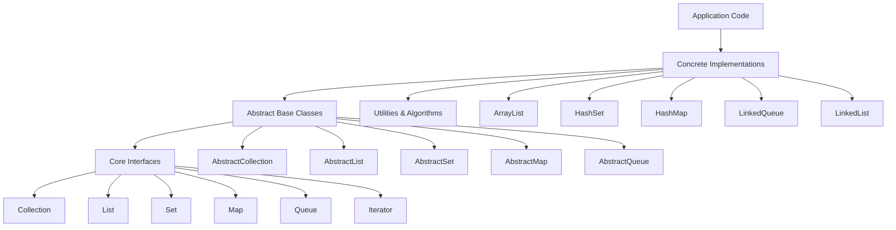

# TypeScript Collections Framework

[](https://opensource.org/licenses/MIT)
[](https://www.typescriptlang.org/)
[](https://vitest.dev/)


A fully-typed, Java-inspired Collections Framework for TypeScript, providing industry-grade implementations of Lists, Sets, Maps, Queues, and Iterators with strict type safety, predictable behavior, and comprehensive test coverage.

## 🎯 Goals

This project aims to provide:

- **Automatic Type Safety**: Runtime type checking enabled by default (no configuration needed)
- **Java-Friendly Design**: Familiar Collections interface for Java developers - works just like Java's type-safe collections
- **Zero-Configuration**: Type safety works out of the box, no need to learn validation libraries
- **Type Safety**: Full TypeScript support with generics and strict typing
- **Predictable Behavior**: Clear contracts through interfaces and abstract base classes
- **Extensibility**: Easy to create custom implementations through abstract base classes
- **Performance Transparency**: Clear documentation of algorithm complexity
- **Test Coverage**: Comprehensive test suites for all implementations (332/332 tests passing)
- **Open Source Quality**: Clean code, best practices, and community-driven development

### For Java Developers

Coming from Java? **You'll feel right at home!** Type safety is automatic by default:

Mermaid Diagram: see diagrams/architecture.mmd
    D --> D3[Set&lt;E&gt;]
    D --> D4[Map&lt;K,V&gt;]
    D --> D5[Queue&lt;E&gt;]
    D --> D6[Iterator&lt;E&gt;]
    
    C --> C1[AbstractCollection&lt;E&gt;]
    C --> C2[AbstractList&lt;E&gt;]
    C --> C3[AbstractSet&lt;E&gt;]
    C --> C4[AbstractMap&lt;K,V&gt;]
### Architecture Diagram



### Core Interfaces

| Interface | Purpose | Methods |
|-----------|---------|---------|
| **Iterator** | Element traversal | `hasNext()`, `next()`, `remove?()` |
| **Collection** | Base collection | `size()`, `add()`, `remove()`, `contains()`, `toArray()`, `toString()`, etc. |
| **List** | Ordered, index-accessible | Extends Collection + `get()`, `set()`, `addAt()`, `indexOf()`, `sort()` |
| **Set** | No duplicates | Extends Collection with uniqueness guarantee |
| **Map** | Key-value mappings | `put()`, `get()`, `remove()`, `keys()`, `values()` |
| **Queue** | FIFO processing | Extends Collection + `offer()`, `poll()`, `peek()` |

### Abstract Base Classes

| Class | Extends | Purpose |
|-------|---------|---------|
| **AbstractCollection** | — | Common Collection operations |
| **AbstractList** | AbstractCollection | Common List operations |
| **AbstractSet** | AbstractCollection | Set-specific behavior |
| **AbstractMap** | — | Common Map operations |
| **AbstractQueue** | AbstractCollection | Queue-specific behavior |

## 📦 Installation

```bash
npm install ts-collections
# or
pnpm add ts-collections
# or
yarn add ts-collections
```


## 🚀 Quick Start

### Automatic Type Safety (Zero Configuration)

**ts-collections** provides automatic runtime type safety out of the box - just like Java's type-safe collections. No configuration needed!

```typescript
import { ArrayList, LinkedList } from 'ts-collections';

const list = new ArrayList<number>();
list.add(1);        // ✓ OK
list.add(2);        // ✓ OK
list.add("text" as any);  // ❌ TypeError: type mismatch (automatic!)
```

**For Java Developers:** This works exactly like Java's `ArrayList<Integer>` - type safety is automatic and enforced at runtime with zero configuration.

### Using Lists

```typescript
import { ArrayList } from 'ts-collections';

const list = new ArrayList<number>();
list.add(1);
list.add(2);
list.add(3);

// Index-based access
console.log(list.get(0)); // 1

// Inserting at position
list.addAt(1, 1.5); // [1, 1.5, 2, 3]

// Iteration
const iterator = list.iterator();
while (iterator.hasNext()) {
  console.log(iterator.next());
}

// Sorting
list.add(3);
list.add(1);
list.add(2);
list.sort(); // [1, 2, 3]

// LinkedList example (stable, in-place merge sort)
const linked = new LinkedList<number>();
linked.add(3);
linked.add(1);
linked.add(2);
linked.sort(); // [1, 2, 3]
```

### Using Sets

```typescript
import { HashSet } from 'ts-collections';

const set = new HashSet<string>();
set.add("apple");
set.add("banana");
set.add("apple"); // No duplicates added

console.log(set.size()); // 2
console.log(set.contains("apple")); // true
```

### Using Maps

```typescript
import { HashMap } from 'ts-collections';

const map = new HashMap<string, number>();
map.put("count", 42);
map.put("total", 100);

console.log(map.get("count")); // 42
console.log(map.keys()); // ["count", "total"]
```

### Using Queues

```typescript
import { LinkedQueue } from 'ts-collections';

const queue = new LinkedQueue<number>();
queue.offer(1);
queue.offer(2);
queue.offer(3);

console.log(queue.poll()); // 1 (FIFO)
console.log(queue.peek()); // 2 (doesn't remove)
```

### Advanced Type Validation (Optional)

For power users who need advanced validation constraints, use Zod schemas:

```typescript
import { ArrayList } from 'ts-collections';
import { z } from 'zod';

// Complex validation with Zod (optional)
const strictNumbers = new ArrayList<number>({
    schema: z.number().positive().int()
});

strictNumbers.add(5);      // ✓ OK
strictNumbers.add(-1 as any);    // ❌ ERROR: must be positive
strictNumbers.add(3.14 as any);  // ❌ ERROR: must be integer
```

**Note:** Zod is optional - basic type safety works automatically without it!

## 🏛️ Design Principles

This project strictly adheres to SOLID principles:

### Single Responsibility Principle (SRP)
Each class has a single, well-defined reason to change. Interfaces define specific contracts, and implementations focus on their specific data structure.

### Open/Closed Principle (OCP)
The design is open for extension through abstract base classes and interfaces, but closed for modification. New implementations can be added without changing existing code.

### Liskov Substitution Principle (LSP)
All subclasses can substitute their parent classes without breaking functionality. For example, any `Collection` can be used where a `Collection` is expected.

### Interface Segregation Principle (ISP)
Clients depend only on methods they actually use. For example, `Queue` doesn't force implementations to implement all `Collection` methods—it extends `Collection` to maintain the contract.

### Dependency Inversion Principle (DIP)
Code depends on abstractions (interfaces and abstract classes), not concrete implementations. Dependency injection is supported through constructor parameters.

## 📊 Complexity Analysis

All data structures include documented time and space complexity:

```typescript
// Example: ArrayList
// add(element): O(1) amortized
// removeAt(index): O(n)
// get(index): O(1)
// indexOf(element): O(n)
```

## 🧪 Testing

The project uses **Vitest** for comprehensive test coverage. Each interface has a test suite that concrete implementations must satisfy.

### Running Tests

```bash
# Run all tests
pnpm test

# Run tests in watch mode
pnpm test --watch

# Run with coverage
pnpm test --coverage
```

### Test Suite Structure

```
test/interfaces/
├── Iterator.test.ts
├── Collection.test.ts
├── List.test.ts
├── Set.test.ts
├── Map.test.ts
└── Queue.test.ts
```

Each test suite exports a factory function that implementations can use:

```typescript
import { describeList } from 'ts-collections/test';

describe('ArrayList', () => {
  describeList(() => new ArrayList<number>());
});
```

## 🛠️ Building Custom Implementations

Extend abstract base classes to create custom data structures:

```typescript
import { AbstractList } from 'ts-collections';

class CustomList<E> extends AbstractList<E> {
  private elements: E[] = [];

  size(): number {
    return this.elements.length;
  }

  get(index: number): E {
    if (index < 0 || index >= this.size()) {
      throw new Error('Index out of bounds');
    }
    return this.elements[index];
  }

  // ... implement remaining abstract methods
}
```

## 📖 Documentation

### Quick References

- **[QUICKSTART.md](QUICKSTART.md)** - Get started in 5 minutes
- **[JAVA_MIGRATION_GUIDE.md](JAVA_MIGRATION_GUIDE.md)** - For Java developers transitioning to TypeScript
- **[RUNTIME_VALIDATION.md](RUNTIME_VALIDATION.md)** - Deep dive into validation features
- **[ARCHITECTURE.md](ARCHITECTURE.md)** - Architecture and design decisions
- **[CONTRIBUTING.md](CONTRIBUTING.md)** - How to contribute
- **[PHASE2_REDESIGN.md](PHASE2_REDESIGN.md)** - Technical details of automatic type safety redesign

### API Documentation

Full API documentation is generated with TypeDoc:

```bash
pnpm docs
```

Documentation is available in `docs/` directory and includes:
- Interface contracts
- Method signatures and descriptions
- Usage examples
- Complexity analysis
 - Sorting semantics (natural vs comparator)
 - String representation via `toString()`

## 🌟 Key Features

### Type Safety
Full TypeScript support with strict null checks and generic type parameters:
```typescript
const list: List<number> = new ArrayList<number>();
// list.add("string"); // ❌ Compile error
list.add(42); // ✅ OK
```

### Comprehensive Contracts
Clear, well-documented interfaces prevent misuse:
```typescript
// Iterator contract guarantees safe traversal
const iterator = collection.iterator();
while (iterator.hasNext()) {
  const element = iterator.next(); // Safe - guaranteed to exist
}
```

### Extensibility
Easy to add new implementations:
```typescript
class TreeSet<E> extends AbstractSet<E> {
  // Custom implementation using a balanced tree
}
```

### Performance Transparency
All operations are documented with their complexity:
```typescript
// O(1) amortized time
list.add(element);

// O(n) time
list.indexOf(element);
```

## 🤝 Contributing

Contributions are welcome! Please follow these guidelines:

1. **Fork** the repository
2. **Create** a feature branch (`git checkout -b feature/amazing-feature`)
3. **Test** your changes (`pnpm test`)
4. **Lint** your code (`pnpm lint`)
5. **Commit** with clear messages
6. **Push** to your branch
7. **Open** a Pull Request

### Development Setup

```bash
# Install dependencies
pnpm install

# Run tests
pnpm test

# Run linter
pnpm lint

# Build the project
pnpm build

# Generate documentation
pnpm docs
```

## 📝 Code Style

This project uses:
- **ESLint** for code quality
- **Prettier** for code formatting
- **TypeScript** strict mode for type safety

All code must pass linting and formatting checks:

```bash
pnpm lint
pnpm format
```

## 📄 License

This project is licensed under the MIT License - see the [LICENSE](LICENSE) file for details.

## 🙏 Acknowledgments

- Inspired by [Java Collections Framework](https://docs.oracle.com/javase/tutorial/collections/)
- Built with [TypeScript](https://www.typescriptlang.org/)
- Tested with [Vitest](https://vitest.dev/)
- Documented with [TypeDoc](https://typedoc.org/)

## 🔗 Related Resources

- [Java Collections Documentation](https://docs.oracle.com/javase/tutorial/collections/)
- [TypeScript Handbook](https://www.typescriptlang.org/docs/)
- [Design Patterns](https://refactoring.guru/design-patterns)
- [SOLID Principles](https://en.wikipedia.org/wiki/SOLID)

## 📞 Support

- **Issues**: [GitHub Issues](https://github.com/yourusername/ts-collections/issues)
- **Discussions**: [GitHub Discussions](https://github.com/yourusername/ts-collections/discussions)
- **Email**: support@example.com

---

**Made with ❤️ by the TypeScript Collections Framework team**
